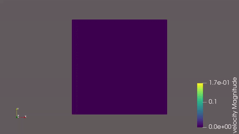
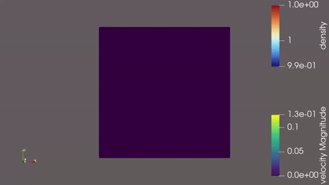
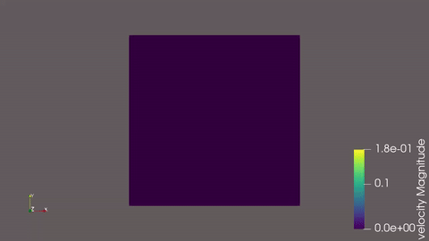
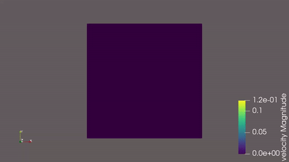
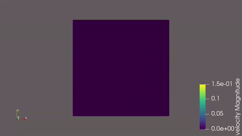
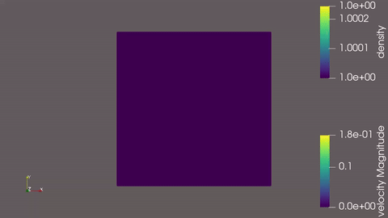

# LBM HPC Simulator

A GPU-accelerated 2D Lattice Boltzmann Method (LBM) solver for the classic **lid-driven cavity** problem, written in C/HIP and built to run natively on AMD GPUs on Windows.

This project started as a way to combine three interests at once: low-level systems programming, GPU/HPC architecture, and computational fluid dynamics — using a real AMD GPU (Radeon RX 9060 XT) instead of the more commonly documented CUDA/NVIDIA path.

<p align="center">
  
  
</p>

---

## Table of Contents

- [What is the Lattice Boltzmann Method?](#what-is-the-lattice-boltzmann-method)
- [The D2Q9 Lid-Driven Cavity Model](#the-d2q9-lid-driven-cavity-model)
- [Why LBM Parallelizes So Well](#why-lbm-parallelizes-so-well)
- [Why a GPU, Specifically](#why-a-gpu-specifically)
- [Tech Stack](#tech-stack)
- [Design Decisions](#design-decisions)
  - [Structure of Arrays (SoA)](#structure-of-arrays-soa)
  - [Double Buffering (Ping-Pong)](#double-buffering-ping-pong)
  - [Binary VTK Output](#binary-vtk-output)
- [The I/O Bottleneck: A Debugging Story](#the-io-bottleneck-a-debugging-story)
- [GPU Profiling with Radeon GPU Profiler](#gpu-profiling-with-radeon-gpu-profiler)
- [Building the Project](#building-the-project)
- [Configuration File Format](#configuration-file-format)
- [Visualizing Results with ParaView](#visualizing-results-with-paraview)
- [Gallery](#gallery)
- [Project Structure](#project-structure)

---

## What is the Lattice Boltzmann Method?

Most CFD (Computational Fluid Dynamics) solvers work by directly discretizing the **Navier-Stokes equations** — the continuum-level equations that describe how pressure, velocity, and viscosity relate to each other in a fluid. The Lattice Boltzmann Method takes a different route entirely.

Instead of tracking pressure and velocity fields directly, LBM models a fluid as a large collection of fictitious particle *distributions* moving on a fixed grid (the "lattice"). At every grid cell, the method keeps track of how much "stuff" is moving in each of a small set of allowed directions. Two simple steps are repeated every timestep:

1. **Collision** — at each cell, the particle distributions relax toward a local equilibrium (computed from the local density and velocity), simulating the effect of microscopic particle collisions.
2. **Streaming** — each distribution then "moves" to the neighboring cell in its direction of travel.

Remarkably, this simple, local, particle-based process — when you take the right mathematical limit — recovers the Navier-Stokes equations as an emergent macroscopic behavior. You get full fluid dynamics out of a cellular-automaton-like update rule, without ever solving a pressure Poisson equation or a global linear system, which is what makes LBM such a good fit for parallel hardware (more on that below).

## The D2Q9 Lid-Driven Cavity Model

This project implements the most common 2D LBM variant: **D2Q9** — *2 Dimensions, 9 discrete velocity directions*. Every cell stores 9 distribution values, one for each direction a "packet" of fluid can move: the 4 axis-aligned directions (N, S, E, W), the 4 diagonals (NE, NW, SE, SW), and the rest state (0 velocity). Each direction has an associated weight (`4/9` for rest, `1/9` for axis-aligned, `1/36` for diagonals) derived from the second-order lattice quadrature used to approximate the Maxwell-Boltzmann equilibrium distribution.

The **collision** step relaxes each distribution toward equilibrium using the BGK (Bhatnagar-Gross-Krook) operator, controlled by a single relaxation parameter, `omega`:

```
f_new = f_old + omega * (f_eq - f_old)
```

`omega` is directly related to the fluid's kinematic viscosity: values close to `2.0` correspond to very low viscosity (more chaotic, vortex-rich flow), while values close to `0` correspond to a thick, sluggish fluid. The simulation enforces `0 < omega < 2` for numerical stability — get too close to `2.0` and the simulation diverges.

The specific problem solved here is the **lid-driven cavity**: a square (or rectangular) box of fluid, walls on three sides, and a lid on top that slides horizontally at a constant velocity (`u_lid`). The three static walls use a standard **bounce-back** boundary condition (incoming distributions are simply reflected back, enforcing a no-slip, zero-velocity wall). The moving lid uses a momentum-corrected bounce-back that adds a small drag term proportional to `u_lid`, which is what actually injects energy into the system and gets the fluid moving.

This single sliding wall is enough to generate a rich set of flow structures: a large primary vortex that fills most of the cavity, plus smaller, weaker secondary vortices that form in the corners opposite the lid — exactly the structures visible in the [gallery](#gallery) below. It's a classic CFD benchmark precisely because the geometry is trivial but the resulting flow is genuinely interesting.

## Why LBM Parallelizes So Well

The collision step is **completely local**: to update a cell, you only need the data already stored in that cell. The streaming step is **nearest-neighbor only**: a distribution only ever moves to one of the 8 adjacent cells. There is no global linear solve, no pressure-correction loop, no long-range data dependency of any kind.

This means every cell in the lattice can, in principle, be updated **completely independently and simultaneously** at every timestep. That property — embarrassingly parallel, fixed and predictable memory access pattern, no synchronization needed *within* a single timestep — is exactly the kind of workload that maps almost perfectly onto SIMD/SIMT hardware. It's a textbook example of why LBM is one of the most GPU-friendly numerical methods in computational physics.

## Why a GPU, Specifically

A modern GPU is built around thousands of small, simple cores grouped into wavefronts/warps that execute the *same instruction* on many data elements at once (SIMT — Single Instruction, Multiple Threads). The `collide_stream_gpu` kernel in this project assigns one GPU thread to one lattice cell; every thread runs the exact same sequence of arithmetic (sum 9 distributions, compute velocity, compute equilibrium, relax) on different data. That's as close to the ideal GPU workload as a numerical method gets.

A CPU, by contrast, has a handful of powerful, deeply-pipelined cores optimized for low-latency, branchy, sequential work — it would have to process the lattice's tens or hundreds of thousands of cells largely one-by-one (or a few-by-few with vectorized SIMD instructions on a handful of cores). For a problem with this much inherent data parallelism and so little control-flow divergence, the GPU isn't just faster — it's the *correct* tool for the job.

## Tech Stack

| Layer | Choice |
|---|---|
| Language | C (host code), HIP/C++ (GPU kernels) |
| GPU API | [HIP](https://rocm.docs.amd.com/projects/HIP/) (AMD ROCm) |
| Build system | CMake + Ninja |
| Compiler | Clang (from the ROCm 7.1 toolchain), driven manually due to Windows HIP-language detection being broken in upstream CMake |
| Target GPU | AMD Radeon RX 9060 XT (`gfx1200`, RDNA 4) |
| OS | Windows 11 (native, no WSL — see note below) |
| Visualization | [ParaView](https://www.paraview.org/) (VTK legacy binary format) |
| Profiling | [Radeon Developer Tool Suite](https://gpuopen.com/rgp/) (Radeon GPU Profiler / Radeon Developer Panel) |

**A note on the build setup:** this project originally targeted WSL2, but development moved to a native Windows build after running into an upstream kernel bug affecting HIP under WSL2. The `CMakeLists.txt` works around a separate, Windows-specific issue where CMake's native `LANGUAGES HIP` detection generates a malformed `CMakeHIPCompiler.cmake`. Instead, `clang++.exe` from the ROCm install is forced in as the C/C++ compiler, and `.hip`/`.c` sources are manually compiled with `-x hip --offload-arch=gfx1200`.

## Design Decisions

### Structure of Arrays (SoA)

The lattice data is *not* stored as one big array of per-cell structs (Array of Structures — AoS). Instead, each physical quantity — the 9 distribution functions, density, and the two velocity components — lives in its own flat, contiguous array:

```c
typedef struct
{
      real_t *df[Q];   // 9 separate arrays, one per direction
      real_t *d_rho;
      real_t *u_x;
      real_t *u_y;
} LatticeSoA;
```

This matters a lot on a GPU. When a wavefront of 32 (or 64) threads all read `df[j][idx]` for consecutive `idx` values, those reads land on **consecutive addresses in memory** — a perfectly *coalesced* access that the memory controller can service as a small number of wide transactions. An AoS layout (`cell[idx].df[j]`) would instead scatter each thread's read across a large stride, fragmenting it into many small, inefficient transactions. SoA is one of the most standard and effective layout choices for GPU-bound, data-parallel simulation code, and it was a deliberate choice from the start of this project.

### Double Buffering (Ping-Pong)

LBM's streaming step reads each cell's neighbors and writes a *new* value for that cell. If this were done in a single buffer, a thread could end up reading a neighbor's value *after* that neighbor had already been overwritten in the same pass — a race condition that would silently corrupt the simulation.

The fix is a standard double-buffering ("ping-pong") scheme: two full copies of the lattice live in VRAM at all times (`lattice_a`, `lattice_b`). Every timestep reads exclusively from one buffer (`in`) and writes exclusively to the other (`out`); at the end of the timestep, the host simply swaps which pointer is "in" and which is "out":

```c
collide_stream_gpu<<<...>>>(*context.lattice_in, *context.lattice_out, ...);
bounce_back_boundaries_gpu<<<...>>>(*context.lattice_in, *context.lattice_out, ...);

LatticeSoA *temp = context.lattice_in;
context.lattice_in = context.lattice_out;
context.lattice_out = temp;
```

This costs 2x the VRAM of an in-place update, but completely eliminates the read/write hazard without needing any synchronization *within* a kernel launch — a good trade for a method this parallel.

### Binary VTK Output

Simulation results are written as **VTK legacy files** in `BINARY` mode (big-endian, per the VTK spec), not the more commonly seen `ASCII` mode. Why this matters is covered in detail in the next section — it turned out to be the single biggest performance decision in the whole project.

## The I/O Bottleneck: A Debugging Story

This project hit a real GPU driver issue early on: the AMD driver's TDR (Timeout Detection and Recovery) was killing the simulation mid-run with a Windows bug-report popup. The instinctive assumption was that the GPU kernel itself was the problem — maybe a megakernel hogging the GPU for too long, maybe uncoalesced memory access, maybe too much CPU↔GPU synchronization overhead.

Profiling with **Radeon GPU Profiler** ruled all of that out. The `collide_stream_gpu` kernel turned out to be close to ideal:

- **Theoretical wavefront occupancy: 16/16** — the maximum possible for the hardware, with the profiler explicitly reporting *"the occupancy of this shader is not limited by any resources"*.
- **No register spilling** to scratch memory.
- Command buffer barriers between dispatches consumed only **~0.16% of frame time** — negligible.
- Memory-unit stall patterns showed short, isolated spikes rather than sustained saturation — consistent with mostly-coalesced access, not a memory-bound kernel.

And yet the profiler's own summary flagged the application as **"CPU bound"**, with **GPU idle: 76–100%** depending on the capture window. The kernel was fast; something *outside* the kernel was the real bottleneck — and because that something wasn't a HIP API call, it was completely invisible to a GPU profiler by construction.

The actual culprit was the `export_vtk` function, which originally wrote every density and velocity value with `fprintf("%f", ...)` — one `fprintf` call per float, per cell, twice (once for density, once for velocity). For a 256×256 grid, that's well over 100,000 individual formatted-text I/O calls *per saved frame*.

This was confirmed empirically rather than assumed: the same simulation was run twice, once with `save_interval` set high enough to essentially skip mid-run I/O, and once with aggressive, frequent saving. Wall-clock time, measured with PowerShell's `Measure-Command`:

| Configuration | Wall-clock time |
|---|---|
| Minimal I/O (compute only) | **3.78 s** |
| Frequent I/O (ASCII `fprintf` per value) | **298.63 s** |

I/O was responsible for roughly **295 seconds out of 298** — the GPU compute itself was a rounding error by comparison.

The fix was to switch `export_vtk` to VTK's `BINARY` mode: build the entire frame's worth of floats in memory, byte-swap each one to big-endian (the legacy VTK binary format predates little-endian x86 and still mandates big-endian byte order), and write the whole block with a single `fwrite` call instead of tens of thousands of `fprintf` calls. After the fix, the same frequent-I/O configuration dropped to:

| Configuration | Wall-clock time |
|---|---|
| Frequent I/O (binary `fwrite`) | **10.13 s** |

A **~29.5x** reduction, taking I/O from being the dominant cost of the simulation to a minor one — and removing the TDR-triggering stall in the process, since the main loop no longer spent hundreds of milliseconds blocked in synchronous text formatting between GPU dispatches.

The broader lesson: a GPU profiler is excellent at telling you a kernel is *not* the bottleneck, but it has no visibility into anything that doesn't go through the GPU API. When "GPU idle" is high and the kernel already looks optimal, the next place to look is wall-clock time around everything *surrounding* the kernel launches — which is exactly how this bottleneck was found.

## GPU Profiling with Radeon GPU Profiler

For anyone wanting to reproduce this kind of investigation on their own AMD GPU project:

1. Install the [Radeon Developer Tool Suite](https://gpuopen.com/rgp/) (includes both the Radeon Developer Panel and Radeon GPU Profiler).
2. Launch the **Radeon Developer Panel**, connect to **Local**, and enable the **Profiling** feature under *Available Features*.
3. Run the target executable — it should appear automatically under *Applications* in the panel (HIP is one of the supported APIs alongside DirectX 12, Vulkan, and OpenCL).
4. Trigger a capture mid-run with the configured hotkey (default `Ctrl+Alt+C`), or click *Capture profile* directly in the panel.
5. Open the resulting `.rgp` file in **Radeon GPU Profiler** to inspect the *Overview* (CPU/GPU-bound summary, barriers, most expensive events) and *Events* tabs (wavefront occupancy, pipeline state, per-dispatch timing).

This project's own profiling session is what produced the wavefront occupancy and "CPU bound" findings described above.

## Building the Project

**Requirements:**
- Windows 11
- [AMD ROCm for Windows](https://rocm.docs.amd.com/) (this project was built against ROCm 7.1)
- CMake ≥ 3.21
- Ninja
- Visual Studio Build Tools (for the MSVC-compatible CRT/linker that the ROCm Clang toolchain targets on Windows)

```powershell
cmake -B build -G "Ninja"
cmake --build build
```

The resulting binary is `build\lbm_simulator.exe`. Adjust `HIP_TARGET_ARCH` in `CMakeLists.txt` if you're building for a GPU other than `gfx1200` (RDNA 4 / RX 9060 XT).

**Running a simulation:**

```powershell
.\build\lbm_simulator.exe .\data\input\turbulent_classic.txt
```

Output `.vtk` frames are written to `data/output/sim_<omega*10>_<u_lid*1000>_<max_iters>/`.

## Configuration File Format

Simulations are configured with a simple `key = value` text file:

```
# Grid dimensions
nx = 256
ny = 256

# Time parameters
max_iters = 50000
save_interval = 100

# Physical parameters
omega = 1.92
u_lid = 0.10
```

| Key | Meaning | Constraints |
|---|---|---|
| `nx`, `ny` | Grid dimensions | `> 2` |
| `max_iters` | Total number of timesteps | `≥ 1` |
| `save_interval` | Write a `.vtk` frame every N steps | `1 ≤ save_interval ≤ max_iters` |
| `omega` | BGK relaxation parameter (inverse of viscosity) | `0 < omega < 2`; values near `2.0` risk numerical instability |
| `u_lid` | Lid (top wall) velocity | `0 < u_lid ≤ 0.105`; LBM assumes low Mach number, so this is kept small relative to the lattice speed of sound |

Sample configs used to produce the gallery below live in `data/input/`.

## Visualizing Results with ParaView

1. Open [ParaView](https://www.paraview.org/) and use **File → Open**, then select the full sequence of `lbm_step_*.vtk` files in a simulation's output folder (ParaView will offer to group them into a single time series automatically).
2. Click **Apply**.
3. In the **Properties** panel, under **Coloring**, switch from the default field to `velocity` and `Magnitude` (or `density` for the density field).
4. **Important:** ParaView calculates the color legend's range from whichever timestep is loaded *when you select the field*, and by default does not auto-update it as you scrub through time. If the view looks like a flat, saturated color with no visible structure, use the **Rescale to Data Range** button near the color legend (or, better, **Rescale to Data Range over all Timesteps**, found in the Color Map Editor) to fix the range to the simulation's true min/max. This is standard, documented ParaView behavior, not a bug.
5. Use the playback controls (or **View → Animation View**) to step through time and watch the vortex develop.
6. For a closer look at corner vortices, try manually tightening the color range's *maximum* value (via **Rescale to Custom Data Range**, or by editing the transfer function directly in the Color Map Editor) to a value well below the primary vortex's peak velocity/density. This saturates the dominant vortex into a single flat color and frees up the rest of the color scale to reveal the much smaller, weaker secondary vortices in the corners.
7. To export an animation: **File → Save Animation**, choose an output format (`.mp4` or an image sequence), and render. GIFs can be produced afterward from the exported video with `ffmpeg`:
   ```powershell
   ffmpeg -i simulation.mp4 -vf "fps=15,scale=600:-1:flags=lanczos,palettegen" palette.png
   ffmpeg -i simulation.mp4 -i palette.png -filter_complex "fps=15,scale=600:-1:flags=lanczos[x];[x][1:v]paletteuse" output.gif
   ```

## Gallery

| Classic Turbulent | Asymmetric |
|---|---|
|  |  |

| Four-Vortex | Off-Center Whisper |
|---|---|
|  |  |

| Long Duration | Turbulent |
|---|---|
|  |  |

## Project Structure

```
.
├── CMakeLists.txt          # Build configuration (manual HIP toolchain setup for Windows)
├── data/
│   ├── input/               # Simulation config files (.txt)
│   └── output/               # Generated .vtk frames (one folder per run, gitignored)
├── docs/
│   └── Backlog.md            # Project backlog / future work notes
├── gifs/                    # Exported animations for the README gallery
├── include/
│   ├── config.h
│   ├── io.h
│   ├── lbm_kernels.h
│   ├── memory.h
│   └── types.h
└── src/
    ├── config.c             # .txt config file parser + validation
    ├── io.c                 # Binary VTK export
    ├── lbm_kernels.hip      # GPU kernels: init, collide+stream, bounce-back boundaries
    ├── main.c               # Simulation driver loop
    └── memory.c             # Host (aligned) and device (HIP) lattice allocation
```
